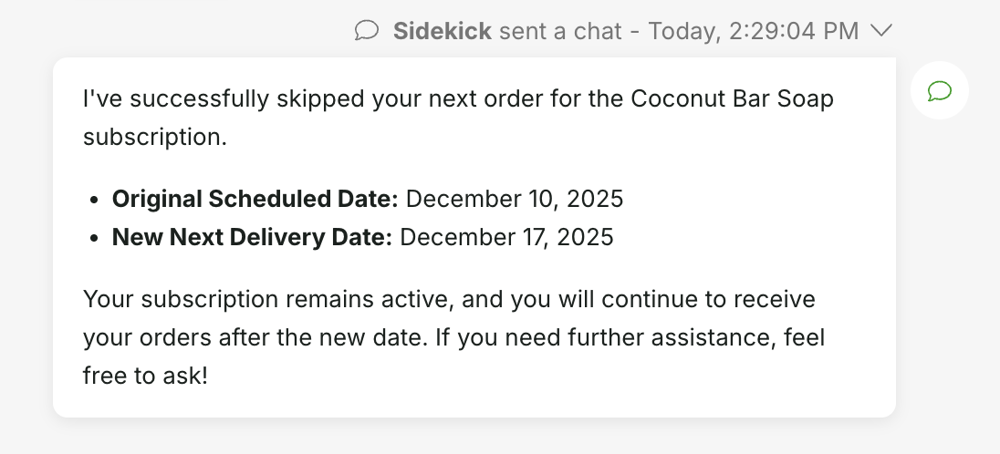

# Ordergroove App Overview

Used with Gladly Sidekick, the Ordergroove app empowers customers to manage subscriptions and related data. It allows customers to perform actions like retrieving subscription details, cancelling subscriptions, reactivating subscriptions, and skipping orders, reducing resolution time for subscription-related inquiries.

  


## Features

The Ordergroove integration provides the following core functionality:

1.  **Data Pulls:**
    - Pull customer data including profile information and contact details
    - Pull subscription data with order history and product details
    - Pull order data with item-level details
    - Pull product catalog information

2.  **Query Actions:**
    - Get all subscriptions for a customer by customer ID (`getSubscriptionsByCustomerId`)
    - Get a single subscription by subscription ID (`getSubscriptionById`)
    - Get shipping address details by address ID (`getShippingAddress`)
    - Get order items for a specific order (`getOrderItems`)
    - Get all available cancellation reasons (`getCancellationReasons`)

3.  **Mutation Actions (Subscription Management):**
    - Cancel a subscription with reason code and details (`cancelSubscription`)
    - Reactivate a cancelled subscription (`reactivateSubscription`)
    - Skip a subscription's next order by removing its items from the order and rescheduling them (`skipSubscription`)

# Ordergroove App Toolkit

## Who maintains the integration

The Ordergroove integration is built and maintained by Gladly.

## How the integration works

The Ordergroove App integrates with the Ordergroove platform via its REST API ([Ordergroove API Documentation](https://developer.ordergroove.com/)). This allows Gladly to:
- Sync customer, subscription, order, and product data when customers interact with Sidekick
- Execute GET requests to retrieve subscription, address, and order item data
- Execute POST/PATCH requests to manage subscriptions (cancel, reactivate, skip)

Authentication is handled via the `x-api-key` header included in all requests.

## Configuration

To use this app, you need to configure the following in `integration.secrets`:

- `api_key`: Your API key for authentication with the Ordergroove platform.

For local testing, create a `.env` file in the `/ordergroove` root directory with:
```
ORDERGROOVE_API_KEY=your_api_key_value
```

# Implementation Details

## Data Pulls

### Customer Data Pull

**Data Type:** `ordergroove_customer` (version 1.0)

**Description:** Syncs customer information from Ordergroove including profile details, contact information, and associated subscriptions.

**API:** GET /customers/?email={email}


**Key Fields:**
- Customer ID, merchant, session information
- Name, email, phone number
- Account status and timestamps
- Related subscriptions (via `@parentId` relationship)

**Use Cases:**
- Match Gladly customers with Ordergroove accounts
- Use customer data in routing rules
- Display customer subscription count in App Cards (if implemented)

### Subscription Data Pull

**Data Type:** `ordergroove_subscription` (version 1.0)

**Description:** Syncs subscription details including frequency, pricing, payment, and shipping information.

**API:** GET /subscriptions/?customer={customerId}

**Key Fields:**
- Subscription ID, customer, merchant, product
- Quantity, price, frequency settings
- Status, cancellation details
- Related orders and product details (via relationship directives)

**Use Cases:**
- Route conversations based on subscription status (active, cancelled)
- Use subscription data in automation rules
- Display subscription details in App Cards (when configured)

### Order Data Pull

**Data Type:** `ordergroove_order` (version 1.0)

**Description:** Syncs order information for subscriptions including pricing, status, and item details.

**API:** GET /orders/?subscription={subscriptionId}

**Key Fields:**
- Order ID, totals (subtotal, tax, shipping, discount)
- Status, timestamps
- Related items (via `@parentId` relationship)

**Use Cases:**
- Route conversations based on order status
- Use order data in automation workflows
- Display order history in App Cards (when configured)

### Item Data Pull

**Data Type:** `ordergroove_item` (version 1.0)

**Description:** Syncs individual line items for orders.

**API:** GET /items/?order={orderId}

**Key Fields:**
- Item ID, product, subscription
- Quantity, pricing
- Product details (via `@childIds` relationship)

**Use Cases:**
- Use item details in routing decisions
- Display order line items in App Cards (when configured)

### Product Data Pull

**Data Type:** `ordergroove_product` (version 1.0)

**Description:** Syncs product catalog information.

**API:** GET /products/{productId}/

**Key Fields:**
- Product ID, name, SKU
- Pricing, image URL, detail URL
- Autoship settings, subscription frequency defaults

**Use Cases:**
- Enrich subscription and order data with product details
- Display product information in App Cards (when configured)

## Actions

### Query Actions

#### getSubscriptionsByCustomerId

**Description:** Returns all subscriptions for a given customer ID. The customer ID should match the customer's ID in the ecommerce platform.

**Input:**
- `customerId: String!` - Customer ID from the ecommerce platform

**Output:**
- `[Subscription]` - Array of subscription objects

**API:** GET /subscriptions/?customer={customerId}

**Use Case:** View all subscriptions for a customer to understand their subscription portfolio.

---

#### getSubscriptionById

**Description:** Returns a single subscription by its subscription ID.

**Input:**
- `subscriptionId: String!` - Unique subscription identifier

**Output:**
- `Subscription` - Single subscription object

**API:** GET /subscriptions/{subscriptionId}/

**Use Case:** Retrieve detailed information about a specific subscription.

---

#### getShippingAddress

**Description:** Returns shipping address details by address ID.

**Input:**
- `addressId: String!` - Unique address identifier

**Output:**
- `ShippingAddress` - Address object with complete shipping details

**API:** GET /addresses/{addressId}/

**Use Case:** View detailed shipping information for a subscription or order.

---

#### getOrderItems

**Description:** Returns all items for a given order ID.

**Input:**
- `orderId: String!` - Unique order identifier

**Output:**
- `[OrderItem]` - Array of order item objects

**API:** GET /items/?order={orderId}

**Use Case:** View all line items in a specific order to understand order composition.

---

#### getCancellationReasons

**Description:** Returns static list of standard and all available OrderGroove cancellation reasons, as well as all recorded reasons for cancellation per application.

**Input:** None

**Output:**
- `CancellationReasonResponse` - Object containing:
  - `standard_cancellation_reasons` - Standard reasons (1-10) commonly used
  - `all_cancellation_reasons` - Comprehensive list (1-60) of all possible scenarios
  - `merchant_cancellation_reasons` - Merchant-specific reasons (100-120)

**API:**
- GET /cancel_reasons/
- GET /merchant/cancel_reason/

**Use Case:** Display available cancellation options to agents when processing subscription cancellations.

**Example Response:**

```json
{
  "standard_cancellation_reasons": [
    {
      "code": "1",
      "description": "Customer Request"
    },
    {
      "code": "2",
      "description": "Fraud"
    }
  ],
  "all_cancellation_reasons": [
    {
      "code": "1",
      "description": "Customer Request"
    },
    {
      "code": "11",
      "description": "Product Discontinued"
    }
  ],
  "merchant_cancellation_reasons": [
    {
      "code": 100,
      "application": "Merchant Request"
    }
  ]
}
```

**Documentation:** [Ordergroove Cancellation Reasons](https://help.ordergroove.com/hc/en-us/articles/360046017813-Subscriptions-Cancel-Reasons)

### Mutation Actions

#### cancelSubscription

**Description:** Cancels a specific customer subscription in Ordergroove.

**Input:**
- `subscriptionId: String!` - Subscription ID to cancel
- `cancelReasonCode: String` - Reason code for cancellation (optional)
- `cancelReasonDetails: String` - Detailed reason for cancellation (optional)

**Output:**
- `Subscription` - The cancelled subscription object

**Result:**
- The subscription is marked as cancelled in Ordergroove
- The cancellation reason is recorded for tracking purposes

**Note:** Cancelled subscriptions can be reactivated using the `reactivateSubscription` action.

**API:** PATCH /subscriptions/{subscriptionId}/cancel/

**Documentation:** [Ordergroove Subscriptions Cancel API](https://developer.ordergroove.com/reference/subscriptions-cancel)

---

#### reactivateSubscription

**Description:** Reactivates a canceled/inactive subscription by its subscription ID.

**Input:**
- `subscriptionId: String!` - Subscription ID to reactivate
- `every: Int!` - Frequency value (e.g., 1, 2, 3)
- `everyPeriod: Int!` - Period type (1=days, 2=weeks, 3=months, 4=years)
- `startDate: String!` - Date to restart subscription (format: YYYY-MM-DD)

**Output:**
- `Subscription` - The reactivated subscription object

**Result:**
- The subscription is reactivated with the specified frequency and start date
- Future billing and shipping schedules will follow the new settings

**API:** POST /subscriptions/{subscriptionId}/reactivate/

**Documentation:** [Ordergroove Subscriptions Reactivate API](https://developer.ordergroove.com/reference/subscriptions-reactivate)

---

#### skipSubscription

**Description:** Skips the next order by removing all items belonging to a specific subscription from the given order and rescheduling them for the following delivery cycle.

This operation allows customers to skip a subscription's next scheduled delivery while keeping the subscription active. The subscription items will be removed from the current order and rescheduled for the next delivery cycle based on the subscription's frequency settings.

**Use Cases:**
- Customer is traveling and wants to skip one delivery
- Customer has excess inventory and wants to delay next shipment
- Customer wants to adjust delivery timing without canceling subscriptions

**Input:**
- `orderId: String!` - The unique identifier of the order containing the subscription to skip. This must be a valid OrderGroove order ID that contains subscription items. The order should be in a state that allows modification (typically pending or scheduled orders).
- `subscriptionId: String!` - The unique identifier of the subscription to skip within the order. This removes all items belonging to this subscription from the order and generates the next order for those items.

**Output:**
- `Order` - The updated Order object after the subscription items have been removed and rescheduled

**API:** PATCH /orders/{orderId}/skip_subscription/

**Request Body:**
```json
{
  "subscription": "subscription_id_here"
}
```

**Documentation:** [Ordergroove Skip Subscription API](https://developer.ordergroove.com/reference/skip-subscription)

# Testing

## Setup

1.  Clone the repository.
2.  Create a `.env` file in the app's root directory (`ordergroove/.env`).
3.  Add the required secrets to the `.env` file:
    ```
    ORDERGROOVE_API_KEY=your_api_key_value

    # Optional: Variables for integration testing
    SUBSCRIPTION_ID=your_subscription_id_here
    ORDER_ID=your_order_id_here
    CUSTOMER_EMAIL_ADDRESS=test@example.com
    ```

You can use `make setup-env` to create a template `.env` file.

## Running Tests

Use the `make` commands from the app's root directory (`cd ordergroove`).

### Core Commands

- **Validate App Configuration:**
  ```bash
  make validate
  ```

- **Run All Unit Tests:**
  ```bash
  make test
  ```

- **Build App Package:**
  ```bash
  make build
  ```

### Component Testing

- **Validate Actions:**
  ```bash
  make validate-actions
  ```

- **Test All Actions:**
  ```bash
  make test-actions
  ```

- **Validate Data Pulls:**
  ```bash
  make validate-data-pulls
  ```

- **Test All Data Pulls:**
  ```bash
  make test-data-pulls
  ```

### Individual Action Tests

- **Query Actions:**
  ```bash
  make test-action-getSubscriptionsByCustomerId
  make test-action-getSubscriptionById
  make test-action-getCancellationReasons
  make test-action-getOrderItems
  make test-action-getShippingAddress
  ```

- **Mutation Actions:**
  ```bash
  make test-action-cancelSubscription
  make test-action-reactivateSubscription
  make test-action-skipSubscription
  ```

### Individual Data Pull Tests

```bash
make test-data-pull-customers
make test-data-pull-subscriptions
make test-data-pull-orders
make test-data-pull-items
```

### Integration Tests (Live API Calls)

**Note:** These require valid credentials in your `.env` file.

- **Run All Integration Tests:**
  ```bash
  make integration-tests
  ```

- **Run Specific Action Against Live API:**
  ```bash
  make run-action-getSubscriptionsByCustomerId
  make run-action-getSubscriptionById
  make run-action-getCancellationReasons
  make run-action-getOrderItems
  make run-action-getShippingAddress
  make run-action-cancelSubscription SUBSCRIPTION_ID=your_id
  make run-action-reactivateSubscription SUBSCRIPTION_ID=your_id
  make run-action-skipSubscription ORDER_ID=your_order_id SUBSCRIPTION_ID=your_subscription_id
  ```

- **Run Data Pulls Against Live API:**
  ```bash
  make run-data-pulls
  make run-data-pull-customers
  make run-data-pull-subscriptions
  make run-data-pull-orders
  ```

- **Run Data GraphQL Queries:**
  ```bash
  make run-data-graphql-customer CUSTOMER_EMAIL_ADDRESS=test@example.com
  make run-data-graphql-subscription SUBSCRIPTION_ID=your_id
  make run-data-graphql-order ORDER_ID=your_id
  ```

### Other Helpful Commands

- **List Available Actions:**
  ```bash
  make list-actions
  ```

- **List Available Data Pulls:**
  ```bash
  make list-data-pulls
  ```

- **Show Help:**
  ```bash
  make help
  ```

# Troubleshooting

- **Authentication Errors:** Ensure the API key in the `.env` file (for local testing) or `integration.secrets` (for deployed app) is correct and has the necessary permissions in Ordergroove.
- **Action Failures:** Check the response provided by the action. Error details are included in the response or logs.
- **Subscription Not Found:** Verify that the subscription ID is correct and the subscription exists in the Ordergroove system.
- **Invalid Address/Order IDs:** Ensure that the address or order ID exists and is associated with the customer's account.
- **Data Pull Failures:** Check that the customer has an email address or the subscription/order exists in Ordergroove. Verify the customer is matched correctly in Gladly.
- **Skip Order Failures:** Ensure the order is in a pending or scheduled state and contains subscription items.
- **Data Not Displayed to Agents:** App Cards must be configured to display data pull information in Gladly Hero. Contact your Gladly administrator to set up App Cards.
