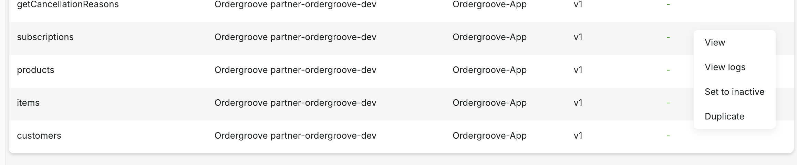

# Ordergroove for Gladly Sidekick

## Overview

Gladly's Ordergroove integration brings subscription management capabilities directly into the Gladly platform. By connecting Ordergroove with Gladly, you enable intelligent routing based on subscription data and empower customers to manage their subscriptions through AI-powered self-service in Gladly Sidekick.

### Key Benefits

- **Intelligent Routing Based on Subscription Status**: Automatically route customers with active subscriptions, at-risk subscriptions, or high lifetime value to specialized teams or priority queues, ensuring the right support at the right time.

- **AI-Powered Subscription Self-Service**: Enable customers to manage their subscriptions autonomously through Sidekick, including viewing subscription details, canceling subscriptions, reactivating subscriptions, and skipping upcoming orders—reducing agent workload while improving customer satisfaction.

   


- **Reduce Churn and Increase Lifetime Value**: Identify at-risk subscriptions early and offer flexible alternatives like skipping deliveries or reactivating canceled subscriptions—turning potential cancellations into satisfied, long-term subscribers.

### Supported Actions

The Ordergroove App supports the following actions:

- **Retrieve Subscription Details**: Fetch comprehensive subscription information including status, products, frequency, and upcoming order dates
- **Cancel Subscription**: Allow customers or agents to cancel subscriptions with optional reason codes for better insights
- **Reactivate Subscription**: Enable customers to restart previously canceled subscriptions with a new delivery schedule
- **Skip Next Order**: Let customers skip their next scheduled delivery while maintaining their subscription

### Data Available in Sidekick

The Ordergroove App automatically retrieves and displays the following subscription data:

**Subscription Details:**

- Subscription ID and status (active, paused, canceled)
- Product information (name, SKU, quantity, variant)
- Subscription frequency (every X days/weeks/months)
- Next order date and delivery schedule
- Subscription creation date
- Price and payment information

**Customer Subscription History:**

- Number of active subscriptions
- Canceled subscriptions
- Total subscription orders fulfilled
- Subscription lifetime value

**Order Information:**

- Upcoming order details
- Order history for subscriptions
- Shipping information

This data can be used in:

- Sidekick Actions to provide context-aware responses
- Routing Rules to intelligently direct conversations
- Analytics to understand subscription-related support patterns

## Key Use Cases

### 1. Subscription-Based Routing and Prioritization

**Use Case**: Route high-value subscription customers to VIP support teams and identify at-risk subscribers for proactive retention efforts.

**How it works**:

- Gladly's Rules engine uses Ordergroove subscription data as routing criteria
- Active subscription customers with high lifetime value are automatically routed to dedicated VIP inboxes
- Customers with recently canceled subscriptions can be flagged and routed to retention specialists
- First-time subscribers can be directed to onboarding teams for a welcoming experience

**Business Impact**: Reduce churn by proactively addressing at-risk customers, increase loyalty by providing white-glove service to VIP subscribers, and optimize team resources by intelligently distributing conversations.

### 2. AI-Powered Subscription Self-Service

**Use Case**: Enable customers to manage their subscriptions 24/7 without agent assistance through Gladly Sidekick.

**Example Customer Flow**:

**Customer**: "I need to skip my next coffee delivery"

**Sidekick**:

- Automatically retrieves the customer's active subscriptions from Ordergroove
- Identifies the customer has a monthly coffee subscription with next delivery on October 20th
- Presents the option to skip the next order
- Upon confirmation, executes the skip action in Ordergroove
- Confirms to the customer: "I've skipped your next delivery. Your coffee subscription will resume on November 20th instead."

**Business Impact**: Reduce ticket volume by enabling instant subscription management, improve customer satisfaction with 24/7 availability, and free agents to focus on complex inquiries.

### 3. Flexible Subscription Management

**Use Case**: Help customers manage their subscriptions with skip functionality to avoid cancellations.

**Example Customer Flow**:

**Customer**: "I have too much product right now"

**Sidekick**:

- Retrieves subscription details showing next delivery on October 20th
- Offers to skip the next order while keeping the subscription active
- Customer confirms: "Yes, skip my next delivery"
- Skips the next order in Ordergroove
- Confirms: "I've skipped your next delivery scheduled for October 20th. Your subscription will resume with a delivery on November 20th."

**Business Impact**: Reduce cancellations by offering skip functionality, increase customer lifetime value by maintaining active subscriptions, and demonstrate customer-centric service.

## Prerequisites

You will need the following from your Ordergroove credentials. Follow [Obtaining Ordergroove credentials](https://help.gladly.com/docs/set-up-ordergroove-integration#obtaining-ordergroove-credentials) to obtain an Ordergroove Application Key.

## Installation

If you have a technical resource at hand you can follow the below steps, otherwise contact Gladly Support to configure this App in your Gladly instance.

### Configuration Steps

1. **[Technical] Install `appcfg`**

   If you haven't already install App Platform CLI tool, which gives you full control of all your App Platform Apps. Follow instructions at https://help.gladly.com/developer-tutorials/docs/install-appcfg

2. **[Technical] Obtain Gladly API Credentials**

   You'll need three pieces of information to authenticate with your Gladly instance:

   - **Gladly Host**: us-1.gladly.com for Production or us-uat.gladly.qa for Sandbox orgs
   - **Gladly User**: Email address of a Gladly user with Administrator or API User permissions
   - **Gladly API Token**: A personal API token for the user above

   To generate an API token, follow the instructions in [Gladly's API Token documentation](https://help.gladly.com/docs/api-authentication#creating-api-tokens).

   Set these as environment variables for convenient use:

   ```bash
   export GLADLY_APP_CFG_HOST="yourcompany.gladly.com"
   export GLADLY_APP_CFG_USER="your.email@company.com"
   export GLADLY_APP_CFG_TOKEN="your-api-token-here"
   ```

3. **[Technical] Configure the App with your Ordergroove credentials**

   ```bash
   appcfg apps config create "gladly.com/Ordergroove-App/v1.0.0" \
     --name "Ordergroove <name of store>" \
     --config '{}' \
     --secrets '{
       "api_key": "<your-application-key>"
     }' \
     --activate
   ```

4. **[Technical] Verify the Configuration**

   ```bash
   appcfg apps config list --identifier "gladly.com/Ordergroove-App/v1.0.0"
   ```

5. **Verify Installation**

   - Navigate to **Settings > App Actions** in Gladly
   - Verify that Ordergroove actions appear
   - Test `customer` Action with a known customer to ensure subscription data is retrieved correctly.

   

### Setting Up Sidekick Guides

Once the app is configured and activated, you can use Ordergroove data and actions in your [Sidekick Guides](https://help.gladly.com/docs/guides-1)

### Setting Up Rules

To be able to use App Platform attributes in Rules and People Match contact Gladly Support.

For additional support, contact Gladly Support with details about the issue and any error messages from the logs.
