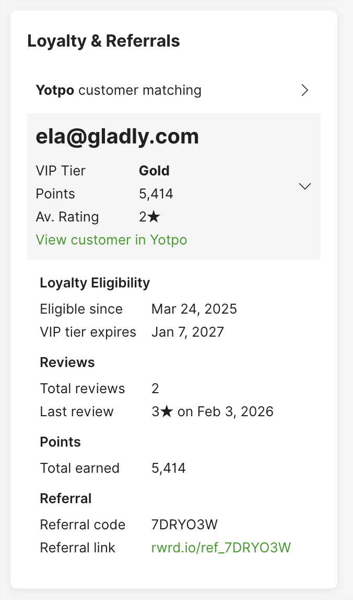
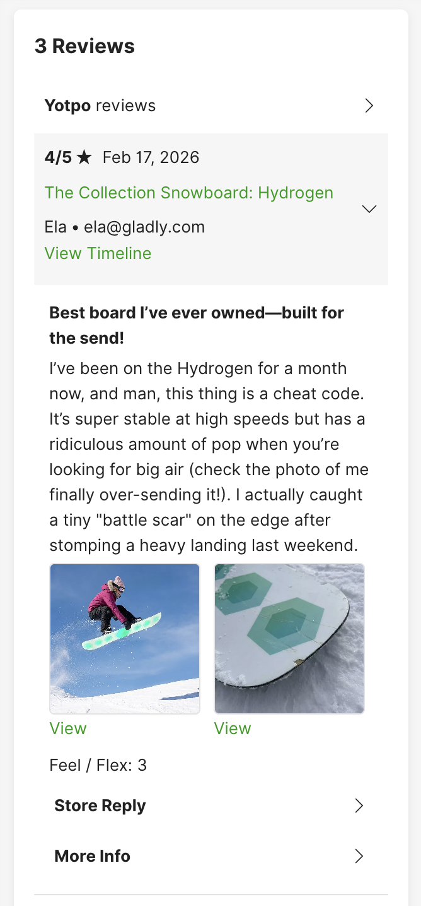

# Yotpo App Platform App

## Overview

Every support interaction is a chance to deepen Customer loyalty — and loyal Customers spend more, refer more, and stay longer. Gladly's [Yotpo](https://www.yotpo.com/) integration brings loyalty, review, and referral data directly into the Gladly platform, so every Conversation — whether handled by a team member or automated — can recognize, reward, and reinforce that loyalty.




### Key benefits

**Give loyal Customers the VIP treatment**
Yotpo loyalty data lets you personalize self-service — for example, automatically approving a refund for a VIP Customer while routing lower-tier requests to a team member for review.

**Route Conversations by loyalty and review data**
VIP tier, point balance, review scores, and other Yotpo attributes can prioritize and route Conversations automatically — so high-value Customers reach the right team without manual triage.

**Acknowledge loyalty from the first message — whether automated or human**
VIP tier, points, and purchase history are available instantly — so every interaction reflects the Customer's value.

**Get the full story before a Customer explains it**
When a Customer who left a review reaches out, team members see the score, content, images, and any store reply — so they already know the issue before the Customer explains it.

### Where it's available

The Yotpo App Platform integration is available across multiple areas of Gladly:

**Gladly**
Yotpo Data Pulls are available in Guides. Guides can retrieve loyalty status, reviews, and referral data during Customer Conversations to provide personalized, context-aware responses.

**Gladly Team**
Two Cards display in Customer Details: Loyalty & Referrals and Reviews. Team members can view a Customer's full Yotpo profile alongside the Conversation.

**Rules and Routing**
Yotpo data attributes — such as VIP tier, point balance, and review scores — are available in Rules to route Conversations to the right team.

## Details

### What data you can access

The Yotpo App retrieves and organizes Customer data into three categories:

**Customer Profile (v1.0):**

- Contact information (email, phone number, first name, last name)
- Account status, default language, and default currency
- Customer tags and list memberships
- Marketing consent (email and SMS subscription status)
- Yotpo UGC summary: total reviews, average product rating, average site rating, overall average rating, sentiment scores, top review topics, and last review date

**Loyalty & Referrals (v1.1):**

- VIP tier name and status
- VIP tier entry date and expiration date
- Points balance, lifetime points earned, and points redeemed
- Next points expiration date and amount
- Credit balance (in store and Customer currency)
- Total spend, total purchases, and last purchase date
- Perks redeemed count
- VIP tier progress: actions completed, maintenance requirements, and upgrade requirements
- Referral code (legacy format) with sharing stats and completed referral details
- Referral link (new format) with direct referral URL
- Birthday, opt-in status, and last seen date

**Reviews (v2.0):**

- Most recent reviews, including unpublished and site reviews (configurable via `reviewLimit`, default: 10, maximum: 50)
- Review score, title, content, and verified buyer status
- Product details: name, URL, category, average score, and product images
- Review images with thumbnail and original URLs
- Custom field responses (reviewer answers to custom form questions)
- Incentive information: whether the review was incentivized and the incentive type (coupon, free product, loyalty points, or other)
- Store replies with content, date, and display name
- Vote counts (up and down)

### How does Customer matching work?

Yotpo finds the right Customer by matching data from their Customer Profile:

1. **Email search** — Searches Yotpo using all email addresses from the Customer Profile.
2. **Phone search** — Searches Yotpo using all mobile phone numbers from the Customer Profile.
3. **Name verification** — If both Gladly and Yotpo have name data, at least one name (first or last) must appear in the Gladly Customer's name. This prevents false matches when different people share an email or phone number.
4. **No match** — If no Yotpo Customer is found, the Card displays empty and Guides receive no Yotpo data for that Customer.

## Key use cases

### 1. Reward loyal Customers automatically

**Use case**: A Gold Paw Club member wants to return a dog raincoat that doesn't fit. Gladly handles it end-to-end based on loyalty tier and order value.

**Example Customer flow**:

**Customer**: "Hi, the raincoat I ordered for my dog doesn't fit. Can I return it?"

**Gladly**:

- Retrieves the Customer's loyalty data from Yotpo — Gold Paw Club tier, 4,200 points, two years of purchases.
- Checks the order value ($38) against the refund threshold ($50).
- The Customer is a Gold tier member and the item is under $50, so Gladly approves the refund automatically.
- Responds: "Of course! I've issued a full refund for the raincoat — you should see it within 3-5 business days. No need to send it back. If you'd like, you could donate it to a local dog shelter. Want help finding the right size for your pup?"

**When conditions aren't met** (e.g., the item is over $50 or the Customer isn't in a loyalty tier):

- Gladly routes the Conversation to a team member with full context — loyalty status, order details, and the Customer's request — so they can make the call.

**Business impact**: Loyal Customers get instant, generous resolutions that reinforce their loyalty AND routine returns are resolved without team member involvement.

### 2. Prioritize VIP Customers with the right team

**Use case**: A VIP Customer reaches out and is automatically routed to a priority team with full context.

**How it works**:

- A Rule checks the Customer's VIP tier from Yotpo data before routing.
- The Conversation is routed to a VIP Inbox for priority handling.
- The team member opens the Conversation and sees the Customer's tier, points balance, and purchase history in the Loyalty & Referrals Card — no searching required.

**Business impact**: High-value Customers get faster, more personal service AND team members have the context to make every interaction count.

### 3. Address negative reviews before the Customer explains

**Use case**: A Customer who left a negative review contacts support. The team member already has the full picture.

**How it works**:

- The team member opens the Reviews Card and sees the review score, content, and any images the Customer attached — for example, a photo of a damaged product.
- If the store has already replied, that response is visible too — so the team member knows what's been communicated.
- Custom field responses (like sizing feedback) give additional context for the issue.

**Business impact**: The Customer doesn't have to repeat themselves, the team member can acknowledge the issue immediately, AND resolution is faster because the context is already there.

## Prerequisites

- A Yotpo account with loyalty, reviews, or referrals enabled
- **Yotpo App Key (store_id)** — Found in Yotpo under **Account Settings** > **General Settings** at the bottom of the page

## Installation

If you have a technical resource who can install and run [appcfg CLI](https://github.com/gladly/app-platform-appcfg-cli) and has access to both your Gladly and Yotpo instances, you can follow the steps below. Otherwise, contact Gladly Support to configure this App in your Gladly instance.

### Configure the app

1. **[Technical] Install appcfg**

   If you haven't already, install the App Platform CLI tool. Follow instructions at [https://help.gladly.com/developer-tutorials/docs/install-appcfg](https://help.gladly.com/developer-tutorials/docs/install-appcfg)

2. **[Technical] Obtain Gladly API credentials**

   You'll need three pieces of information to authenticate with your Gladly instance:

   - **Gladly Host**: us-1.gladly.com for Production or us-uat.gladly.qa for Sandbox orgs
   - **Gladly User**: Email address of a Gladly user with Administrator or API User permissions
   - **Gladly API Token**: A personal API token for the user above

   To generate an API token, follow the instructions in [Gladly's API Token documentation](https://help.gladly.com/docs/api-authentication#creating-api-tokens).

   Set these as environment variables:

   ```bash
   export GLADLY_APP_CFG_HOST="us-1.gladly.com"  # or us-uat.gladly.qa for Sandbox
   export GLADLY_APP_CFG_USER="your.email@company.com"
   export GLADLY_APP_CFG_TOKEN="your-api-token-here"
   ```

3. **[Technical] Gather Yotpo credentials**

   Follow [this Yotpo Guide](https://support.yotpo.com/docs/finding-your-yotpo-app-key-and-secret-key) to obtain your Yotpo app key.

   - **App Key (store_id)** — Select **Account Settings** > **General Settings**. You'll find your App Key at the bottom of the General Settings section.

4. **[Technical] Configure the app with your store_id**

   ```bash
   appcfg apps config create "gladly.com/yotpo/v2.0.0" \
     --name "Yotpo <store name>" \
     --config '{"store_id": "<yotpo_store_id>"}' \
     --secrets '{}'
   ```

   - `reviewLimit`: Number of reviews to fetch per Customer (default: 10, maximum recommended: 50)

5. **[Technical] List configurations to get configuration ID**

   ```bash
   appcfg apps config list --identifier "gladly.com/yotpo/v2.0.0"
   ```

   Note the `CONFIG ID` from the output.

6. **[Technical] Run the OAuth authorization flow**

   Complete the OAuth authorization:

   ```bash
   appcfg apps oauth <config-id>
   ```

   This will:

   - Open a browser window for Yotpo OAuth authorization
   - Prompt you to authorize the app with your Yotpo admin account
   - If successful you will see a blank screen with confirmation text

7. **[Technical] Activate your app**

   When you have completed the OAuth flow, activate your app:

   ```bash
   appcfg apps config update <config-id> --activate
   ```

   If you have any issues, contact Gladly Support.

8. **Verify installation**

   Navigate to **Settings** > **App Actions** in Gladly and verify that Yotpo data loads correctly. Test with a known Customer to confirm data is retrieved.

### Set up Guides

Once the App is configured and activated, you can use Yotpo data in your [Guides](https://help.gladly.com/docs/guides-1).

### Set up Rules

To use Yotpo attributes in Rules and People Match, contact Gladly Support.

### Set up Cards

When ready, reach out to Gladly Support to enable Yotpo Cards in Customer Details.

## Who maintains this integration

The Yotpo App Platform integration is built and maintained by Gladly.

## How the integration works

The Yotpo App integrates with three Yotpo REST APIs: Core API v3 (customer profiles), Loyalty API v3 (points, tiers, referrals), and Reviews API v2 (reviews and ratings). Authentication uses OAuth 2.0 (authorization code grant), with access tokens passed as query parameters.

The App uses three Data Pulls — Customer Profile, Loyalty & Referrals, and Reviews — to retrieve data in real time when a Customer Conversation begins.

## Get help

For additional support or troubleshooting, contact Gladly Support with details about the issue and any error messages.

If you want to dive deeper into the technical details of the App, you can find it in our [app-platform-examples repository](https://github.com/gladly/app-platform-examples). You can always clone it and adapt it to your needs.
